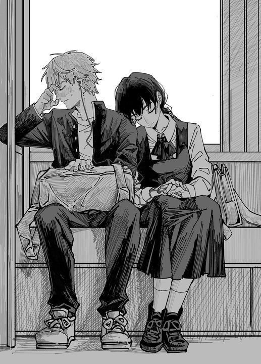
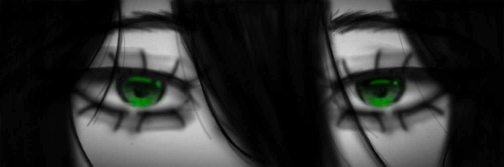
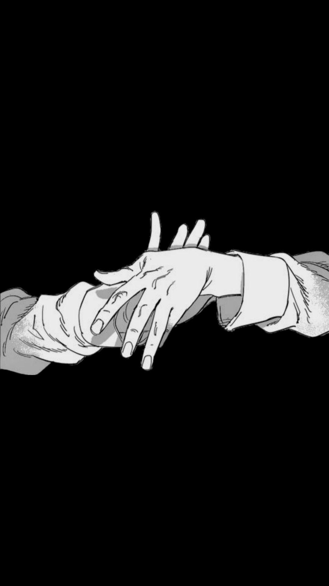
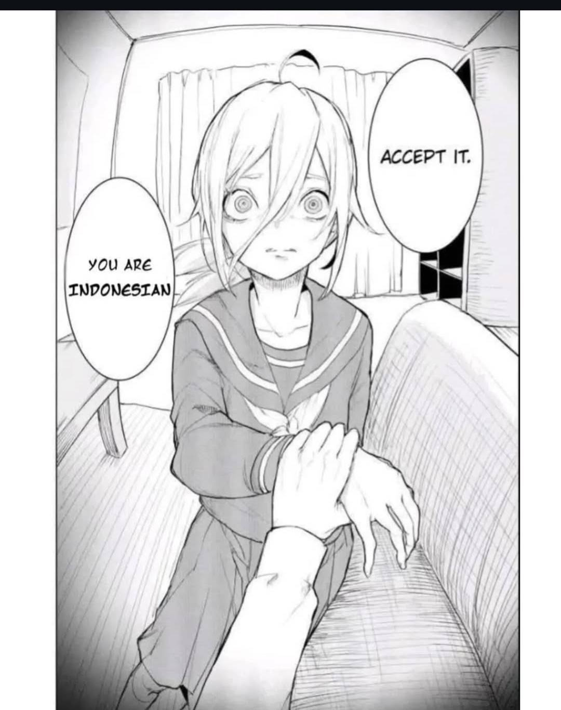
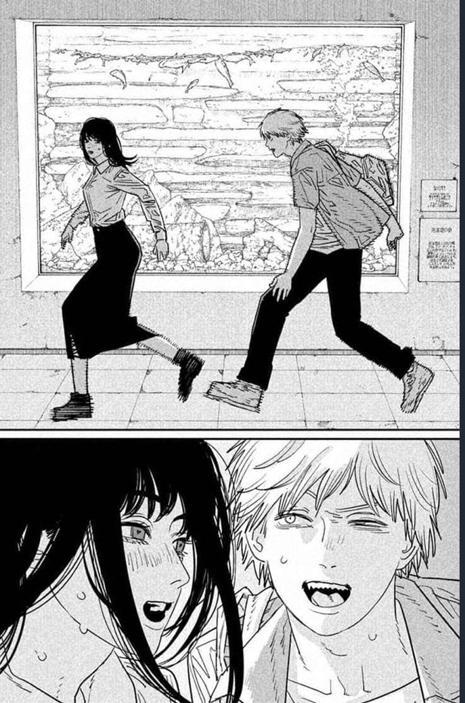
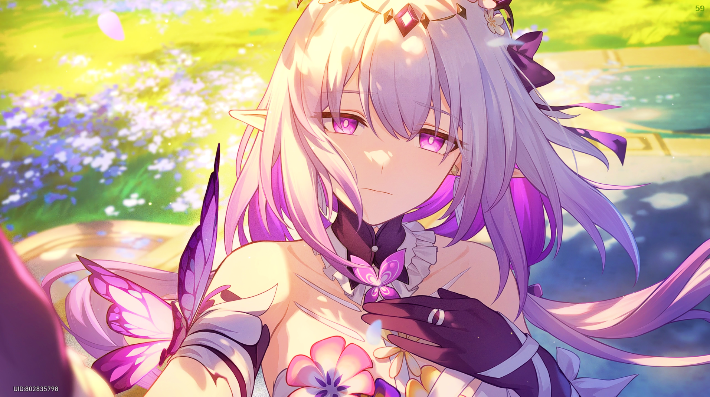
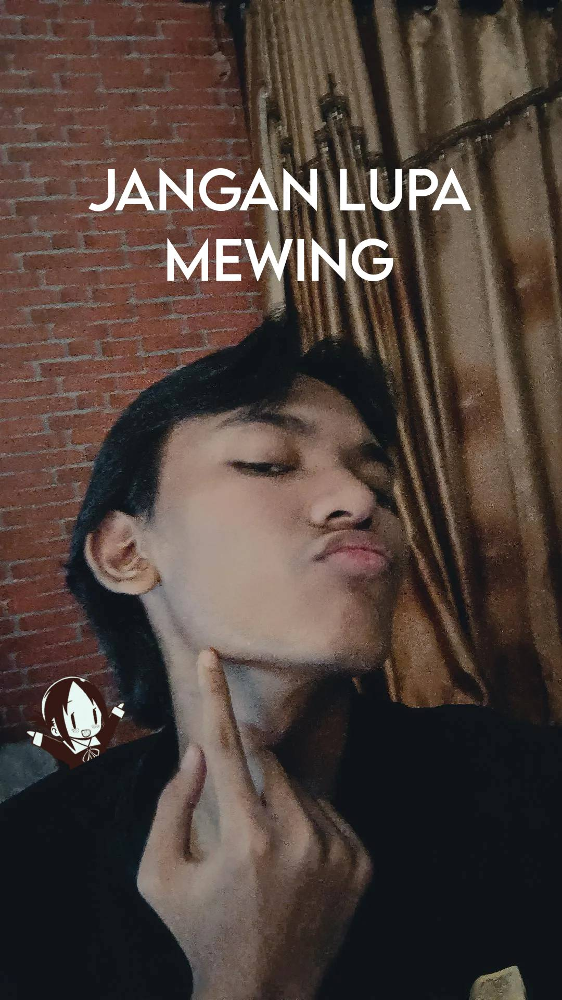
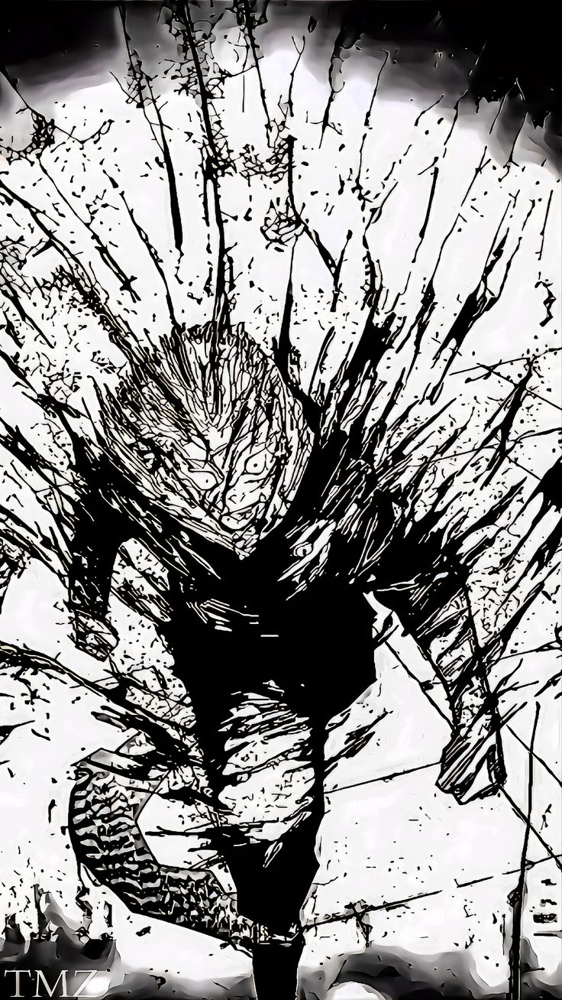
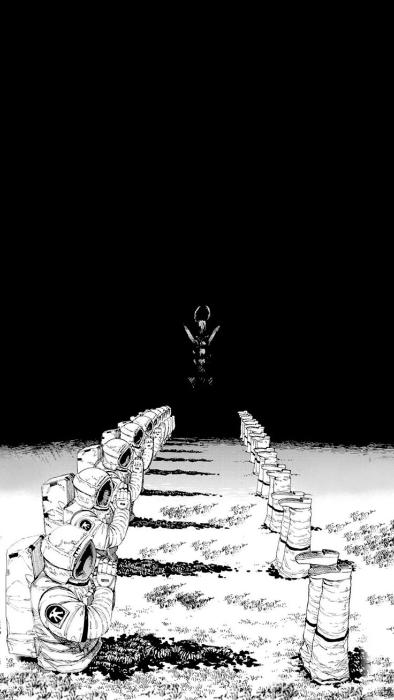
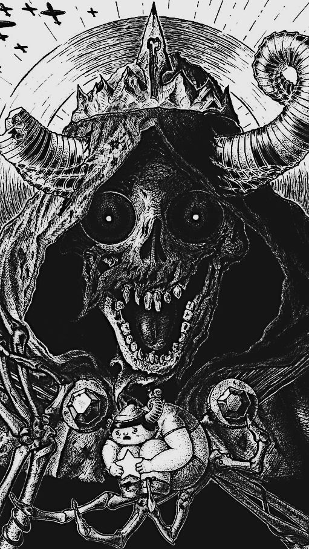

# Pertemuan 4
folder ini berisi gallery dan kode analisanya

## Bagian Html

### Memasukkan gambar
```html
<ul class="gallery">
  <li class="gallery-item"></li>
  <li class="gallery-item"></li>
  <li class="gallery-item"></li>
  <li class="gallery-item"></li>
  <li class="gallery-item"></li>
  <li class="gallery-item"></li>
  <li class="gallery-item"></li>
  <li class="gallery-item"></li>
  <li class="gallery-item"></li>
  <li class="gallery-item"></li>
  <li class="gallery-item"></li>
  <li class="gallery-item"></li>
  <li class="gallery-item"></li>
  <li class="gallery-item"></li>
  <li class="gallery-item"></li>
  <li class="gallery-item"></li>
  <li class="gallery-item"></li>
  <li class="gallery-item"></li>
  <li class="gallery-item"></li>
  <li class="gallery-item"></li>
  <li class="gallery-item"></li>
  <li class="gallery-item"></li>
  <li class="gallery-item"></li>
  <li class="gallery-item"></li>
  <li class="gallery-item"></li>
  <li class="gallery-item"></li>
</ul>
```
Menggunakan ul atau unordered list dengan class gallery yang didalamnya terdapat li atau list item yang digunakan untuk mengisi gambar sesuai list dengan class bernama gallery item disertai img src yang akan memanggil file gambar yang ditampilkan kemudian mengubah namanya menjadi image 1 untuk dimasukkan ke dalam data.

## Bagian CSS
### Mengatur tampilan gallery
```css
.gallery {
margin: 0;
padding: 20px;
column-count: 4;
column-gap: 1.2rem;
}
```
- margin: 0; = membuat agar tidak ada jarak di luar galeri.
- padding: 20px; = memberi ruang 20px di dalam kontainer galeri.
- column-count: 4; = membagi konten menjadi 4 kolom.
- column-gap: 1.2rem; = memberi jarak antar kolom sebanyak 1.2rem.

### Card/blok untuk isi gallery
```css
.gallery-item {
list-style: none;
margin: 0 0 1.2rem;
break-inside: avoid;
border-radius: 12px;
overflow: hidden;
background: #222;
box-shadow: 0 4px 10px rgba(0,0,0,0.4);
}
```
- list-style: none; = menghilangkan angka (jika ini <li>) agar tampilan lebih bersih.
- margin: 0 0 1.2rem; = menjaga jarak bawah 1.2rem antar item.
- break-inside: avoid; = mencegah item pecah saat pindah kolom.
- border-radius: 12px; = membuat sudut item membulat 12px.
- overflow: hidden; = mengubah agar konten yang melewati batas item dipotong.
- background: #222; = membuat background gelap pada item.
- box-shadow: 0 4px 10px rgba(0,0,0,0.4); = membuat bayangan halus di belakang objek.

### Mengatur gambar
```css
img {
display: block;
width: 100%;
height: auto;
border-radius: 12px;
transition: transform 0.4s, box-shadow 0.4s;
}
```
- display: block; = membuat gambar jadi elemen blok penuh.
- width: 100%; = mengubah gambar agar menyesuaikan lebar container.
- height: auto; = mengatur tinggi otomatis supaya proporsinya tetap.
- border-radius: 12px; = agar sudut gambar membulat.
- transition: transform 0.4s, box-shadow 0.4s; = menampilkan animasi yang halus saat gambar di-hover.

### Efek hover gambar
```css
img:hover {
transform: scale(1.05);
box-shadow: 0 8px 20px rgba(255,255,255,0.4);
}
```
- transform: scale(1.05); = membuat gambar sedikit membesar saat kursor berada di atasnya.
- box-shadow: 0 8px 20px rgba(255,255,255,0.4); = membuat bayangan putih muncul saat di hover.

### Mengatur kolom
```css
@media (max-width: 1200px) {
.gallery {
column-count: 3;
}
}
@media (max-width: 900px) {
.gallery {
column-count: 2;
}
}
@media (max-width: 600px) {
.gallery {
column-count: 1;
}
}
```

mengatur kolom gambar sesuai ukuran layar
- layar ≤1200px → kolom jadi 3.
- layar ≤900px → kolom jadi 2.
- layar ≤600px → kolom jadi 1.
>>>>>>> b4a259fbc625c50cc71eecf934cdee434814baf1
