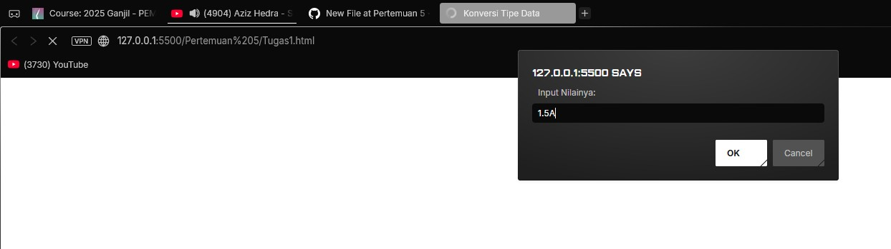
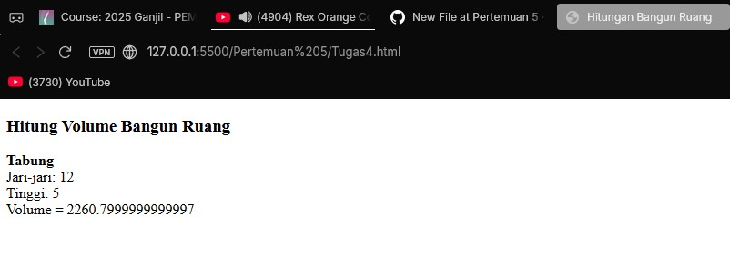

<<<<<<< HEAD
# Pertemuan 5 
Berisi praktikum 5 dan analisanya

## 2a. [`2a.html`](2a.html)
Output:

Analisis:
- `script language="JavaScript"` = kode bahasa JavaScript 
- `document.write("Program JavaScript Aku di kepala");` = menuliskan teks langsung ke halaman web saat dijalankan.
- `document.write("Program JavaScript Aku di body");` = menuliskan teks ke halaman di bagian body.

## 2b. [`2b.html`](2b.html)
Output:

Analisis:
- `` = cara untuk menye;ipkan file JavaScript eksternal dengan nama contoh.js ke dalam halaman HTML dan browser akan membaca tag ini lalu menjalankan isi file contoh.js.

## 2c. [`2c.html`](2c.html)
Output:

Analisis:

- `<button onclick="tampilkan_nama()">klik disini</button>` = Membuat tombol dengan teks "klik disini". Saat tombol ditekan, fungsi tampilkan_nama() akan dijalankan.
- `

` = Membuat elemen `
` kosong dengan id="hasil". Nanti isi dari div ini akan diubah oleh JavaScript.
- `function tampilkan_nama()` =  Mendefinisikan fungsi bernama tampilkan_nama.

- `document.getElementById("hasil")` = Mencari elemen dengan id "hasil".

- `.innerHTML = "<h3>Nama Saya Adalah Andi Akram Nur Risal</h3>";` = Mengubah isi elemen tersebut menjadi teks dengan tag `<h3>`.
- Hasilnya: setelah tombol diklik, teks nama akan muncul di dalam `
`.

## 2d. [`2d.html`](2d.html)
Output:

Analisis:

- `document.write("Selamat Belajar Angkatan 2019"," ");` = menggunakan document.write agar langsung tertulis ke halaman web dengan isi nya ditambah ` ` untuk baris baru
- `document.write("JavaScript Pemrograman WEB Teknik Komputer");` = Mirip dengan yang pertama hanya saja tidak bikin baris baru.

## 3. [`3.html`](3.html)
Output:

Analisis:
- `var nama = prompt("Siapa nama Anda?");` = prompt membuka kotak input di browser dan menampilkan pesan "Siapa nama Anda?"apapun yang diketik oleh user akan disimpan di variabel nama.
- `document.write("Hai, " + nama);` = menulis teks ke halaman web yang berisi teks "Hai" diikuti dengan isi dari variabel nama.

## 4a. [`4a.html`](4a.html)
Output:

Analisis:
- `window.alert("Apakah anda mau keluar?");` = menampilkan jendela alert yang menampilkan teks "Apakah anda mau keluar?" dan tombol ok.

## 4b. [`4b.html`](4b.html)
Output:

Analisis:
 - `var jawaban = window.confirm("Apakah anda sudah yakin ?");` = menampilkan jendela konfirmasi yang berisi teks "Apakah anda sudah yakin?" dengan pilihan ok atau cancel dan pilihannya akan disimpan di jawaban.
 - `document.write("Jawaban Anda: " + jawaban);` = menampilkan teks "Jawaban Anda: " diikuti dengan pilihan yang tersimpan pada jawaban.

 ## 5a. [`5a.html`](5a.html)
Output:

Analisis:
- `var VariabelKu;` = membuat variabel bernama VariabelKu.
- `var VariabelKu2 = 3;` = membuat variabel bernama VariabelKu2 yang diisi dengan nilai 3.
- `VariabelKu = 1234;` = mengisi nilai 1234 pada VariabelKu.
- `document.write(VariabelKu*VariabelKu2);` = menampilkan teks pada halaman web yang dimana teksnya ialah hasil kali dari isi VariabelKu dan isi dari VariabelKu2.

## 5b1. [`5b1.html`](5b1.html)
Output:

Analisis:
- `var a = 12;` = mendeklarasi variabel a dengan isi 12
- `var b = 4;` = mendeklarasi variabel b dengan isi 4
- `function Perkalian_Dengan2(b) {a = b * 2;return a;}` = membuat fungsi dengan nama Perkalian_Dengan2 dengan parameter b,
yang di dalam fungsinya terdapat, nilai a yang akan diubah menjadi b dikalikan dengan  2.
Lalu mengembalikan nilai a.
- `document.write( " Dua kali dari " ,b, " adalah = " ,Perkalian_Dengan2(b));` = menampilkan teks "Dua kali dari " diikuti nilai b "adalah = " dan hasil dari Perkalian_Dengan2(b) pada halaman web.
- `document.write( " Nilai dari a adalah = " ,a);` = menampilkan teks" Nilai dari a adalah = " diikuti nilai a pada halaman web 

## 5b2. [`5b2.html`](5b2.html)
Output:

Analisis:
- sama saja dengan praktikum 5b1 hanya saja dalam function Perkalian_dengan2(b) mengubah a = b * 2 menjadi variabel sehingga pada `document.write( " Nilai dari a adalah = " ,a);` akan menggunakan variabel a utama dan bukan variabel a pada function.

## 7. [`7.html`](7.html)
Output:

Analisis:
- membuat variael a dengan isinya yaitu function parseInt() yang dimana itu adalah fungsi yang digunakan untuk mengubah string menjadi bilangan bulat (integer).
- membuat variael b dengan isinya yaitu function parseFloat() yang dimana itu adalah fungsi yang digunakan untuk mengubah string menjadi bilangan desimal (float).

## 8. [`8.html`](8.html)
Output:

Analisis:
- `document.write("2 + 3 = " + (2 + 3));` = menampilkan teks "2 + 3 = hasil dari penjumlahan 2 ditambah 3" pada halaman web.
- `document.write(" ");` = pindah baris baru.
- `document.write("20 - 3 = " + (20 - 3));` = menampilkan "20 - 3 = hasil dari 20 dikurangi 3" pada halaman web.
- `document.write("20 * 3 = " + (20 * 3));` = menampilkan "20 * 3 = hasil dari 20 dikali 3" pada halaman web.
- `document.write("40 / 3 = " + (40 / 3));` = menampilkan "40 / 3 = hasil bagi dari 40 dibagi 3" pada halaman web.

## 9. [`9.html`](9.html)
Output:

Analisis:
- `var nilai = prompt("Nilai (0-100): ", 0);` = membuat variabel nilai dengan isi dari prompt yang dimana user diminta memasukkan nilai mulai dari 0-100.
 - `var hasil = (nilai >= 60) ? "Lulus" : "Tidak Lulus";` = membuat variabel hasil yang berisi isi dari variabel nilai yang dimana jika isi dari variabel nilai lebih atau sama dengan 60 maka tampilkan lulus jika tidak maka tidak lulus
 - `document.write("Hasil: " + hasil);` = menampilkan teks "hasil" diikuti dengan nilai dalam variabel hasil.

## Tugas 1. [`Tugas1.html`](Tugas1.html)
Gambar Input:

Gambar Output:

## Tugas 2. [`Tugas2.html`](Tugas2.html)
Gambar Input:

Gambar Output:

## Tugas 3. [`Tugas3.html`](Tugas3.html)
Gambar:

## Tugas 4. [`Tugas4.html`](Tugas4.html)
Gambar Input:

Gambar Output:

=======
# Pertemuan 5 
Berisi praktikum 5 dan analisanya

## 2a. [`2a.html`](2a.html)
Output:

Analisis:
- `script language="JavaScript"` = kode bahasa JavaScript 
- `document.write("Program JavaScript Aku di kepala");` = menuliskan teks langsung ke halaman web saat dijalankan.
- `document.write("Program JavaScript Aku di body");` = menuliskan teks ke halaman di bagian body.

## 2b. [`2b.html`](2b.html)
Output:

Analisis:
- `` = cara untuk menye;ipkan file JavaScript eksternal dengan nama contoh.js ke dalam halaman HTML dan browser akan membaca tag ini lalu menjalankan isi file contoh.js.

## 2c. [`2c.html`](2c.html)
Output:

Analisis:

- `<button onclick="tampilkan_nama()">klik disini</button>` = Membuat tombol dengan teks "klik disini". Saat tombol ditekan, fungsi tampilkan_nama() akan dijalankan.
- `

` = Membuat elemen `
` kosong dengan id="hasil". Nanti isi dari div ini akan diubah oleh JavaScript.
- `function tampilkan_nama()` =  Mendefinisikan fungsi bernama tampilkan_nama.

- `document.getElementById("hasil")` = Mencari elemen dengan id "hasil".

- `.innerHTML = "<h3>Nama Saya Adalah Andi Akram Nur Risal</h3>";` = Mengubah isi elemen tersebut menjadi teks dengan tag `<h3>`.
- Hasilnya: setelah tombol diklik, teks nama akan muncul di dalam `
`.

## 2d. [`2d.html`](2d.html)
Output:

Analisis:

- `document.write("Selamat Belajar Angkatan 2019"," ");` = menggunakan document.write agar langsung tertulis ke halaman web dengan isi nya ditambah ` ` untuk baris baru
- `document.write("JavaScript Pemrograman WEB Teknik Komputer");` = Mirip dengan yang pertama hanya saja tidak bikin baris baru.

## 3. [`3.html`](3.html)
Output:

Analisis:
- `var nama = prompt("Siapa nama Anda?");` = prompt membuka kotak input di browser dan menampilkan pesan "Siapa nama Anda?"apapun yang diketik oleh user akan disimpan di variabel nama.
- `document.write("Hai, " + nama);` = menulis teks ke halaman web yang berisi teks "Hai" diikuti dengan isi dari variabel nama.

## 4a. [`4a.html`](4a.html)
Output:

Analisis:
- `window.alert("Apakah anda mau keluar?");` = menampilkan jendela alert yang menampilkan teks "Apakah anda mau keluar?" dan tombol ok.

## 4b. [`4b.html`](4b.html)
Output:

Analisis:
 - `var jawaban = window.confirm("Apakah anda sudah yakin ?");` = menampilkan jendela konfirmasi yang berisi teks "Apakah anda sudah yakin?" dengan pilihan ok atau cancel dan pilihannya akan disimpan di jawaban.
 - `document.write("Jawaban Anda: " + jawaban);` = menampilkan teks "Jawaban Anda: " diikuti dengan pilihan yang tersimpan pada jawaban.

 ## 5a. [`5a.html`](5a.html)
Output:

Analisis:
- `var VariabelKu;` = membuat variabel bernama VariabelKu.
- `var VariabelKu2 = 3;` = membuat variabel bernama VariabelKu2 yang diisi dengan nilai 3.
- `VariabelKu = 1234;` = mengisi nilai 1234 pada VariabelKu.
- `document.write(VariabelKu*VariabelKu2);` = menampilkan teks pada halaman web yang dimana teksnya ialah hasil kali dari isi VariabelKu dan isi dari VariabelKu2.

## 5b1. [`5b1.html`](5b1.html)
Output:

Analisis:
- `var a = 12;` = mendeklarasi variabel a dengan isi 12
- `var b = 4;` = mendeklarasi variabel b dengan isi 4
- `function Perkalian_Dengan2(b) {a = b * 2;return a;}` = membuat fungsi dengan nama Perkalian_Dengan2 dengan parameter b,
yang di dalam fungsinya terdapat, nilai a yang akan diubah menjadi b dikalikan dengan  2.
Lalu mengembalikan nilai a.
- `document.write( " Dua kali dari " ,b, " adalah = " ,Perkalian_Dengan2(b));` = menampilkan teks "Dua kali dari " diikuti nilai b "adalah = " dan hasil dari Perkalian_Dengan2(b) pada halaman web.
- `document.write( " Nilai dari a adalah = " ,a);` = menampilkan teks" Nilai dari a adalah = " diikuti nilai a pada halaman web 

## 5b2. [`5b2.html`](5b2.html)
Output:

Analisis:
- sama saja dengan praktikum 5b1 hanya saja dalam function Perkalian_dengan2(b) mengubah a = b * 2 menjadi variabel sehingga pada `document.write( " Nilai dari a adalah = " ,a);` akan menggunakan variabel a utama dan bukan variabel a pada function.

## 7. [`7.html`](7.html)
Output:

Analisis:
- membuat variael a dengan isinya yaitu function parseInt() yang dimana itu adalah fungsi yang digunakan untuk mengubah string menjadi bilangan bulat (integer).
- membuat variael b dengan isinya yaitu function parseFloat() yang dimana itu adalah fungsi yang digunakan untuk mengubah string menjadi bilangan desimal (float).

## 8. [`8.html`](8.html)
Output:

Analisis:
- `document.write("2 + 3 = " + (2 + 3));` = menampilkan teks "2 + 3 = hasil dari penjumlahan 2 ditambah 3" pada halaman web.
- `document.write(" ");` = pindah baris baru.
- `document.write("20 - 3 = " + (20 - 3));` = menampilkan "20 - 3 = hasil dari 20 dikurangi 3" pada halaman web.
- `document.write("20 * 3 = " + (20 * 3));` = menampilkan "20 * 3 = hasil dari 20 dikali 3" pada halaman web.
- `document.write("40 / 3 = " + (40 / 3));` = menampilkan "40 / 3 = hasil bagi dari 40 dibagi 3" pada halaman web.

## 9. [`9.html`](9.html)
Output:

Analisis:
- `var nilai = prompt("Nilai (0-100): ", 0);` = membuat variabel nilai dengan isi dari prompt yang dimana user diminta memasukkan nilai mulai dari 0-100.
 - `var hasil = (nilai >= 60) ? "Lulus" : "Tidak Lulus";` = membuat variabel hasil yang berisi isi dari variabel nilai yang dimana jika isi dari variabel nilai lebih atau sama dengan 60 maka tampilkan lulus jika tidak maka tidak lulus
 - `document.write("Hasil: " + hasil);` = menampilkan teks "hasil" diikuti dengan nilai dalam variabel hasil.

## Tugas 1. [`Tugas1.html`](Tugas1.html)
Gambar Input:

Gambar Output:

## Tugas 2. [`Tugas2.html`](Tugas2.html)
Gambar Input:

Gambar Output:

## Tugas 3. [`Tugas3.html`](Tugas3.html)
Gambar:

## Tugas 4. [`Tugas4.html`](Tugas4.html)
Gambar Input:

Gambar Output:

>>>>>>> dde7d6b367fcf2b2c33baa8314c892d94dd15221
