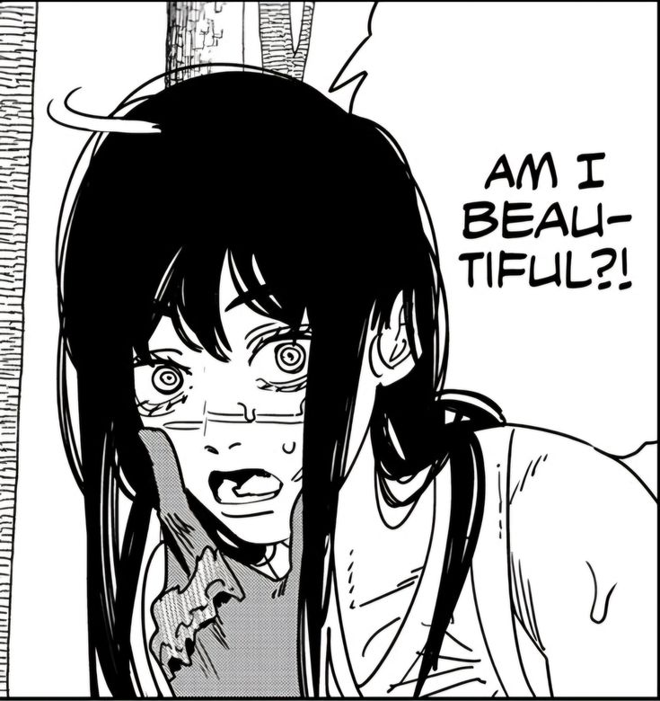

# Portofolio 
Folder ini berisi gambar dan code html+css yang saya gunakan dalam membuat portofolio saya.

# Struktur Dokumen

## Analisa Html

### Struktur Html
```html
<!DOCTYPE html>
<html lang="id">
<head>
  <meta charset="UTF-8">
  <title>My Porto Saya</title>
  <link rel="stylesheet" href="style.css">
</head>
<body>
```
- <!DOCTYPE html> → Mendefinisikan dokumen sebagai HTML5.
- <html lang="id"> → Bahasa halaman Indonesia untuk SEO dan accessibility.
- <head> → Berisi metadata, charset UTF-8, judul halaman, dan link ke CSS eksternal.
- <body> → Menampung seluruh konten yang tampil di halaman.
  
### Header
```html
<header>
  <div class="header-container">
    <div class="profil-menu">
      
      <nav>
        <ul>
          <li><a href="#tentang">Tentang</a></li>
          <li><a href="#hobi">Kesukaan</a></li>
          <li><a href="#socialmedia">Social Media</a></li>
        </ul>
      </nav>
    </div>
    <h1><a href="#welcome">Portofolio Saya</a></h1>
  </div>
</header>
```
- .header-container → Flex container menata menu dan judul secara horizontal.
- .profil-menu → Blok profil dengan gambar dan menu dropdown.
- nav → Navigasi dengan link anchor ke section tertentu.
- h1 → Judul halaman yang bisa diklik untuk scroll ke section welcome

### Section Welcome
```html
<main>
  <section id="welcome">
    <h1 class="welcome-text">Selamat Datang</h1>
  </section>
```
- .welcome-text → Teks animasi masuk dari kiri (fadeInCenter).
- Section ini fullscreen (min-height: 100vh) dengan teks di tengah layar.a

### Section Tentang Saya
```html
<section id="tentang">
  <div class="section-header">
    <h2>Tentang Saya</h2>
    <hr>
  </div>
  <div class="section-content">
    <div class="tentang-text">
      <p>
        Halo, saya Reefat Rabani Izzan seorang mahasiswa prodi Teknik Komputer di Universitas Negeri Makassar.<br>
        Saya bercita-cita menjadi game-dev karena ketertarikan saya terhadap game dan teknologi.<br>
        Usia: 19<br>
        Tinggi Badan: 169cm<br>
        Berat Badan: 55kg
      </p>
    </div>
    <div class="tentang-image">
      
    </div>
  </div>
</section>
```
- .section-header → Judul section + garis horizontal untuk visual separation.
- .section-content → Grid dua kolom: teks di kiri, gambar di kanan.
- .slide-in-image → Animasi gambar masuk dari kanan saat section menjadi target

### Section Hobi bagian Gaming
```html
<section id="hobi">
  <div class="section-header">
    <h2>Kesukaan</h2>
    <hr>
  </div>
  <div class="hobi-container">
    <div class="Hobii">
      <h3>Gaming</h3>
      <p>Game yang saya mainkan:</p>
      <a href="https://hsr.hoyoverse.com/" target="_blank">
        
      </a>
      <a href="https://playvalorant.com/" target="_blank">
        
      </a>
    </div>
```
- .Hobii → Card individu untuk tiap kategori hobi.
- Gambar → Hover glow dan efek transisi saat section aktif.
- <a target="_blank"> → Membuka link di tab baru.

### Bagian Anime/Manga dan Musik
```html
    <div class="Hobii">
      <h3>Anime/Manga</h3>
      <p>Anime/Manga favorit saya:</p>
      <a href="https://myanimelist.net/anime/44511/Chainsaw_Man" target="_blank">
        
      </a>
      <a href="https://myanimelist.net/anime/34572/Black_Clover" target="_blank">
        
      </a>
    </div>

    <div class="Hobii">
      <h3>Musik</h3>
      <p>Musisi favorit saya:</p>
      <a href="https://open.spotify.com/artist/1Xyo4u8uXC1ZmMpatF05PJ" target="_blank">
        
      </a>
      <a href="https://open.spotify.com/artist/79JgYJHiBUZcvYqOC5Zufn" target="_blank">
        
      </a>
    </div>
  </div>
</section>
```
- Mirip Gaming, tiap .Hobii memiliki gambar + animasi muncul saat section aktif.
- Struktur memudahkan layout responsive dengan flex/grid.
  
### Section Social Media
```html
<section id="socialmedia">
  <div class="section-header">
    <h2>Social Media</h2>
  </div>
  <div class="section-content social-content">
    <p>X: <a href="https://x.com/reeraiz_" target="_blank">@reeraiz_</a></p>
    <p>Instagram: <a href="https://instagram.com/reeraiz" target="_blank">@reeraiz</a></p>
  </div>
</section>
```
- .social-content → Animasi muncul dari bawah saat section aktif (:target).
- Link → Efek hover underline, warna kuning (#ffcc00).

### Footer
```html
</main>

<footer>
  <p>&copy; 2025 Masih Hidup</p>
</footer>

</body>
</html>
```
- Sederhana, menampilkan teks hak cipta.
- Terletak di bawah halaman, konsisten dengan warna header/nav

## Analisa CSS

### Struktur CSS
### Global & Body Styles

```css
html {
  scroll-behavior: smooth;
  scroll-padding-top: 100px;
}

body {
  margin: 0;
  font-family: Arial, sans-serif;
  background-color: #111;
  color: #eee;
  line-height: 1.6;
}
```
- Smooth scroll saat navigasi anchor.
- Padding-top untuk header tetap terlihat.
- Body → Font default, background gelap, teks terang, line-height nyaman dibaca.

### Header & Navigasi Utama

```css
header {
  position: sticky;
  top: 0;
  background: #222;
  z-index: 1000;
  padding: 10px 40px;
  box-shadow: 0 4px 8px rgba(0,0,0,0.4);
}

.header-container {
  display: flex;
  justify-content: space-between;
  align-items: center;
}

header h1 a {
  color: #fff;
  text-decoration: none;
  font-weight: bold;
  font-size: 28px;
  text-shadow: 0 0 5px #fff;
  transition: 1s color, 1s text-shadow;
}

header h1 a:hover {
  color: #ffcc00;
  text-shadow: 0 0 15px #ffcc00, 0 0 25px #ffcc00;
}

```
- Sticky header dengan shadow.
- Flex layout untuk menu + judul.
- Judul h1 → Hover animasi warna dan shadow.

### Profil & Menu Dropdown

```css
.profil-menu {
  position: relative;
}

.profil-header {
  width: 60px;
  height: 60px;
  border-radius: 50%;
  cursor: pointer;
  transition: 1s transform, 1s box-shadow;
}

.profil-header:hover {
  transform: scale(1.1);
  box-shadow: 0 8px 20px rgba(255, 255, 255, 0.7);
}

.profil-menu nav {
  opacity: 0;
  transform: translateY(-20px);
  pointer-events: none;
  position: absolute;
  top: 70px;
  left: 0;
  background: #222;
  padding: 10px;
  border-radius: 8px;
  transition: all 1s ease;
  box-shadow: 0 4px 12px rgba(0,0,0,0.4);
}

.profil-menu:hover nav {
  opacity: 1;
  transform: translateY(0);
  pointer-events: auto;
}
```
- Foto profil → Bulat + efek hover.
- Menu dropdown → Muncul saat hover dengan transisi smoot

### Menu List & Link

```css
.profil-menu nav ul,
nav ul {
  list-style: none;
  margin: 0;
  padding: 0;
  display: flex;
  flex-direction: column;
  gap: 10px;
}

nav ul {
  display: flex;
  gap: 20px;
}

.profil-menu nav ul li a,
nav ul li a {
  color: #eee;
  text-decoration: none;
  transition: 1s color;
}

.profil-menu nav ul li a:hover,
nav ul li a:hover {
  color: #ffcc00;
}
```
- Mengatur tampilan list link, spasi antar link, warna default dan efek hover.

### Section & Animasi Scrol

```css
section {
  display: flex;
  flex-direction: column;
  padding: 20px 40px;
  box-sizing: border-box;
  opacity: 0;
  transform: translateY(50px);
  transition: all 1s ease;
}

section:target {
  opacity: 1;
  transform: translateY(0);
}
```
- Setiap section muncul dengan animasi dari bawah saat target.
- Padding umum untuk konsistensi layout.

### Welcome Section

```css
#welcome {
  display: flex;
  justify-content: center;
  align-items: center;
  background-color: #000;
  min-height: 100vh;
}

.welcome-text {
  font-size: 80px;
  font-family: "consolas", sans-serif;
  font-weight: bold;
  color: #fff;
  text-align: center;
  opacity: 0;
  transform: translateX(-80px);
  animation: fadeInCenter 1s ease forwards;
}

@keyframes fadeInCenter {
  to { opacity: 1; transform: translateX(0); }
}
```
- Fullscreen welcome section.
- Teks animasi muncul dari kiri (fadeInCenter)

### Tentang Section

```css
#tentang {
  background: #111;
  min-height: 100vh;
}

#tentang .section-header h2 {
  font-size: 100px;
  text-align: center;
  margin-bottom: 20px;
}

#tentang .section-header hr {
  width: 100%;
  height: 2px;
  background-color: #ffcc00;
  border: none;
  margin: 0 auto;
}

#tentang .section-content {
  display: grid;
  grid-template-columns: 1fr 1fr;
  align-items: center;
  gap: 50px;
}

.tentang-text {
  font-size: 2rem;
  line-height: 1.8;
  text-align: justify;
}

.tentang-image {
  display: flex;
  justify-content: center;
}

.slide-in-image {
  width: 450px;
  border-radius: 10px;
  opacity: 0;
  transform: translateX(100px);
  transition: all 1s ease;
}

#tentang:target .slide-in-image {
  opacity: 1;
  transform: translateX(0);
}
```
- Dua kolom grid (teks + gambar).
- Animasi gambar masuk dari kanan saat section aktif.

### Hobi Section

```css
#hobi {
  background: #1a1a1a;
  min-height: 100vh;
  display: flex;
  flex-direction: column;
  align-items: center;
  padding: 40px 20px;
}

.Hobii {
  background: #333;
  padding: 40px;
  border-radius: 10px;
  text-align: center;
  width: 300px;
  opacity: 0;
  transform: translateY(50px);
  transition: all 1s ease;
}

#hobi:target .Hobii {
  opacity: 1;
  transform: translateY(0);
}

.Hobii img {
  width: 150px;
  border-radius: 10px;
  margin: 10px;
  transition: transform 1s, box-shadow 1s;
}
```
- Card hobi → Animasi muncul dari bawah.
- Gambar → Hover glow & transition smooth.

### Social Media Section

```css
#socialmedia {
  background: #131212;
  min-height: 50vh;
  display: flex;
  flex-direction: column;
  justify-content: center;
  align-items: center;
  padding: 40px 20px;
}

.social-content {
  flex-direction: column;
  align-items: center;
  justify-content: center;
  min-height: 50vh;
  opacity: 0;
  transform: translateY(50px);
  transition: all 1s ease;
}

#socialmedia:target .social-content {
  opacity: 1;
  transform: translateY(0);
}

#socialmedia a {
  color: #ffcc00;
  text-decoration: none;
  transition: 1s color;
}

#socialmedia a:hover {
  text-decoration: underline;
}
```
- Animasi muncul dari bawah saat target.
- Hover pada link → underline, warna kuning.

### Footer

```css
footer {
  text-align: center;
  padding: 20px;
  background: #222;
  margin-top: 30px;
  border-top: 1px solid #444;
}
```
- Footer sederhana di bagian bawah halaman.
- Memberikan jarak, warna gelap, dan border atas.
